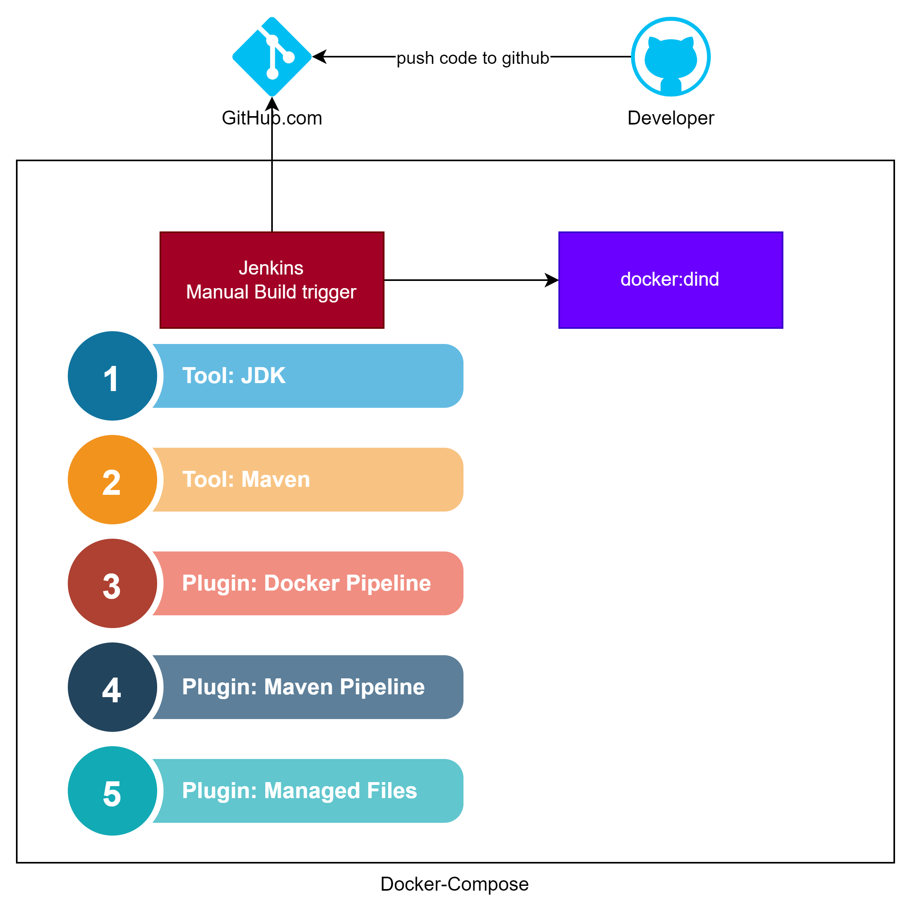
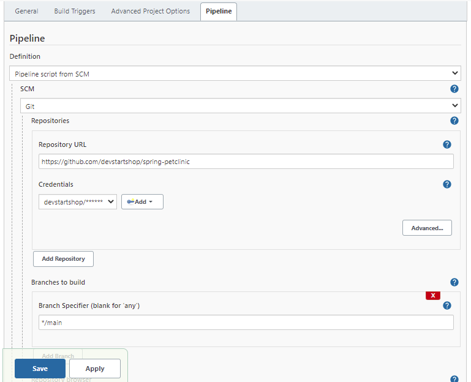
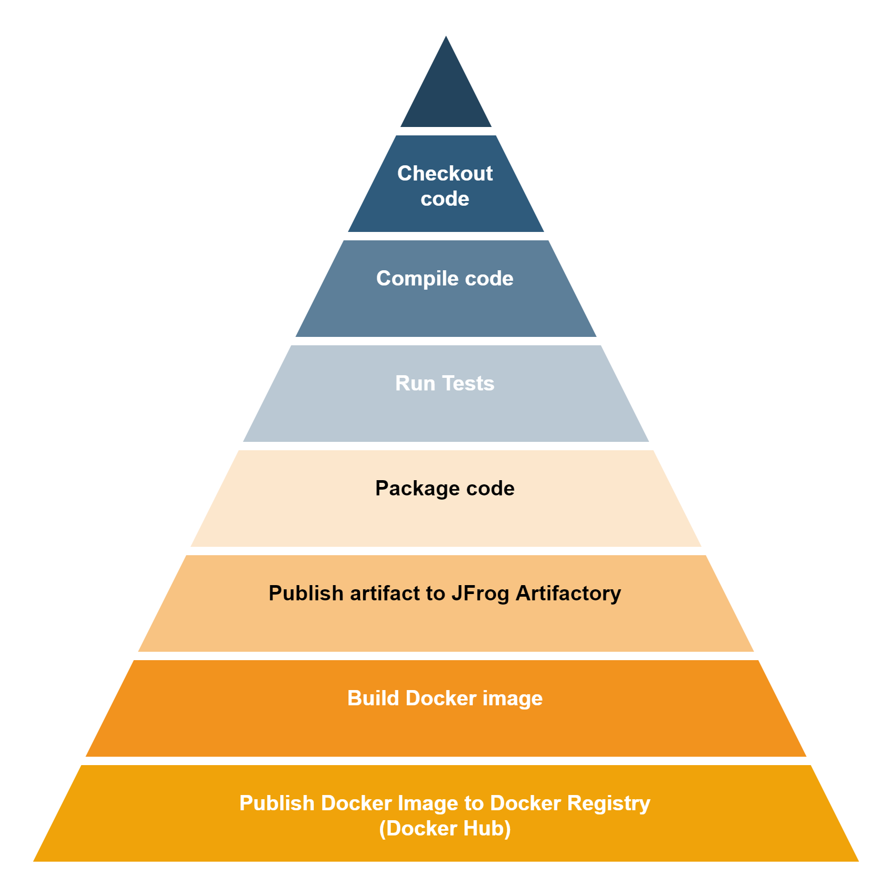
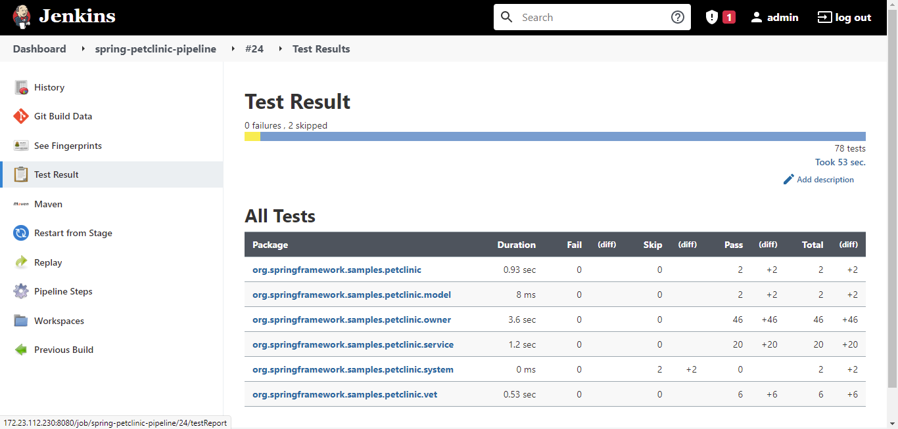

# Spring PetClinic Sample Application [](https://github.com/spring-projects/spring-petclinic/actions/workflows/maven-build.yml)

## Understanding the Spring Petclinic application with a few diagrams
<a href="https://speakerdeck.com/michaelisvy/spring-petclinic-sample-application">See the presentation here</a>

## Running petclinic locally using source code
Petclinic is a [Spring Boot](https://spring.io/guides/gs/spring-boot) application built using [Maven](https://spring.io/guides/gs/maven/). You can build a jar file and run it from the command line (it should work just as well with Java 8, 11 or 17):

## Running petclinic locally as docker container
### Docker Hub Location for container images
https://hub.docker.com/repository/docker/devstartshop/spring-petclinic

Find tagname from this location and use it with below command to run the petclinic application as docker container
```
docker run -p8080:8080 devstartshop/spring-petclinic:<tagname>
```

You can then access petclinic here: http://localhost:8080/


## Deployment Process
The project contains 2 files important for deployment
1. **Dockerfile** - used to build a docker image using the _app.jar_ file that gets generated in _target/_ folder when application is build using maven build tool. the container is set to run with a non root user 1001 and exposes port 8080
2. **Jenkinsfile** - used to declare step-by-step stages to checkout, compile, test, build and publish the application. The Declarative pipeline defined in Jenkinsfile has some prerequisites to run successfully on the Jenkins server.

I have used a Jenkins DIND setup using a docker compose file. this runs Jenkins server as a docker container and enables us to run docker commands from within the container to build the application docker image.

I have configured below tools in Jenkins Global Tool Configuration:

1. All defaults plugins
2. **Managed File** plugin to define custom Maven settings.xml file that helps to resolve maven dependencies from JFrog Artifactory (JCenter Remote)
3. **Maven Pipeline** plugin for withMaven DSL commands
4. **Docker pipeline** plugin for withDockerRegistry DSL command.
5. JAVA 11
6. MAVEN 3.8.4
7. Credentials (Personal Access Token) for repository on the guthub.com to push code.


# Additional Setup required for Executing Jenkins pipeline
Run Jenkins in a docker container with docker-dind as sidecar and then configure environment variables in jenkins to point to docker host in dind container.

Files used:
1. Dockerfile
2. docker-compose.yaml
Make sure both files a in the same directory and docker is running and docker-compose command is available.

Files used:
1. Dockerfile
```dockerfile
FROM jenkins/jenkins:lts-jdk11
USER root
RUN apt-get update && apt-get install -y apt-transport-https \
       ca-certificates curl gnupg2 \
       software-properties-common
RUN curl -fsSL https://download.docker.com/linux/debian/gpg | apt-key add -
RUN apt-key fingerprint 0EBFCD88
RUN add-apt-repository \
       "deb [arch=amd64] https://download.docker.com/linux/debian \
       $(lsb_release -cs) stable"
RUN apt-get update && apt-get install -y docker-ce-cli
```
2. docker-compose.yaml
```yaml
version: "3.7"

services:
  docker:
    image: docker:dind
    privileged: true
    ports:
      - "2376:2376"
    environment:
      - DOCKER_TLS_CERTDIR=/certs
    networks:
      - jenkins
    volumes:
      - jenkins-docker-certs:/certs/client
      - jenkins-data:/var/jenkins_home

  jenkins:
    build:
      dockerfile: ./Dockerfile
      context: ./
    networks:
      - jenkins
    environment:
      - DOCKER_HOST=tcp://docker:2376
      - DOCKER_CERT_PATH=/certs/client
      - DOCKER_TLS_VERIFY=1
    volumes:
      - jenkins-data:/var/jenkins_home
      - jenkins-docker-certs:/certs/client:ro
    ports:
      - "8080:8080"
      - "50000:50000"
    dns: ["8.8.8.8"]

networks:
  jenkins: { }

volumes:
  jenkins-docker-certs: { }
  jenkins-data: { }
```

Run below command to start the Jenkins server
```shell
docker-compose up
```
Follow the steps as guided by jenkins to complete the setup.

Once Jenkins server is up and running, install the Tools and Plugins mentioned above.

### Steps to create a pipeline in Jenkins server
1. Add Docker registry credentials to credentials store using the credentialsId used in the declarative pipeline (Jenkinsfile)
2. Create New Item > Pipeline
3. Add Pipeline configuration as per below screenshot and click save.:
4. 

A Glance at Jenkins Stages:


### Run Tests Report
Once the Jenkins build completes, we can see the test report generated by maven surefire plugin.
Below screenshot shows Maven Test run report.


